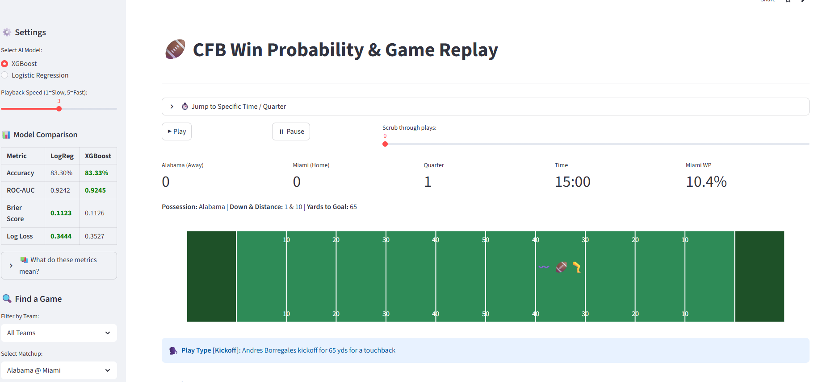

# 🏈 College Football Win Probability Model

An interactive win probability model for college football that updates after every play.  
Built using machine learning and deployed as a live Streamlit app.

---

## 🔗 Links

- 🌐 **Live App:** https://cfb-win-probability-8uj6gnxua2l5gy8xgbhyqr.streamlit.app/
- 📄 **Report:** https://github.com/ahampto/CFB-Win-Probability/blob/main/Final_Report.pdf
- 📊 **Presentation:** https://github.com/ahampto/CFB-Win-Probability/blob/main/Final_presentation.pdf

---

## 🚀 What This Does
## 🖥️ App Preview

- Tracks win probability **play-by-play**
- Updates probability based on:
  - score
  - time remaining
  - field position
  - game situation
- Lets users **replay full games interactively**
- Highlights the **most impactful play ("Play of the Game")**

---

## 🧠 Approach (High Level)

Instead of relying only on complex models, this project focuses on **structuring the data to reflect how football works**.

Key ideas:
- A lead becomes more important as time runs out
- Large leads are safer than small leads
- Momentum from recent plays matters
- Pre-game expectations matter early, but less over time

Two models were used:
- Logistic Regression
- XGBoost

Both performed similarly, showing that **feature design was the most important factor**.

---

## 📊 Results

- ROC-AUC: ~0.92  
- Accuracy: ~83%  
- Well-calibrated probability predictions (not just correct outcomes)

---

## 🖥️ App Features

- Play-by-play game replay
- Smooth win probability graph
- Model comparison (LogReg vs XGBoost)
- Automatic detection of key turning points

---

## 📌 Takeaway

When the data is structured well, even simpler models can perform at a very high level.  
In this project, feature engineering captured most of the complexity of the problem.

---

## ⚙️ Tech Stack

- Python
- scikit-learn
- XGBoost
- Streamlit
- Plotly

---

## 👤 Author

Alvin Hampton
